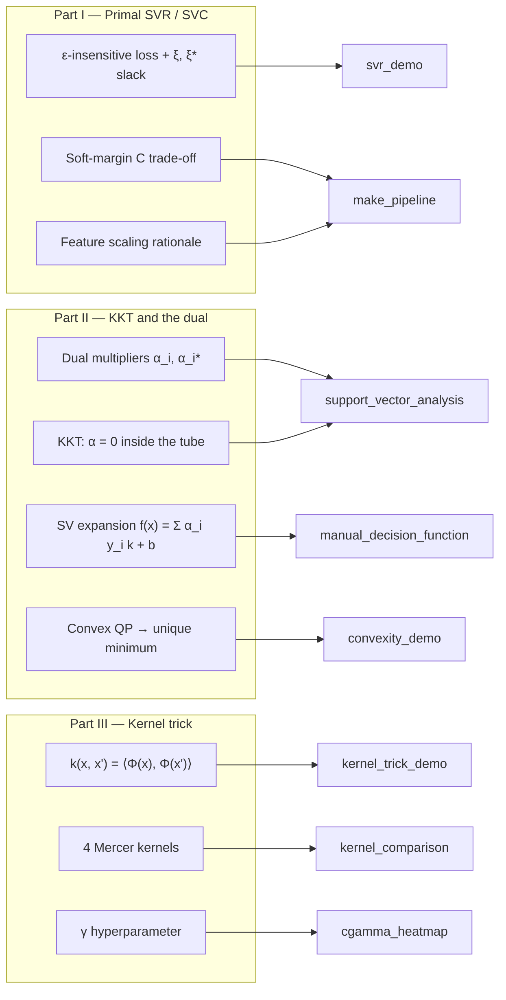
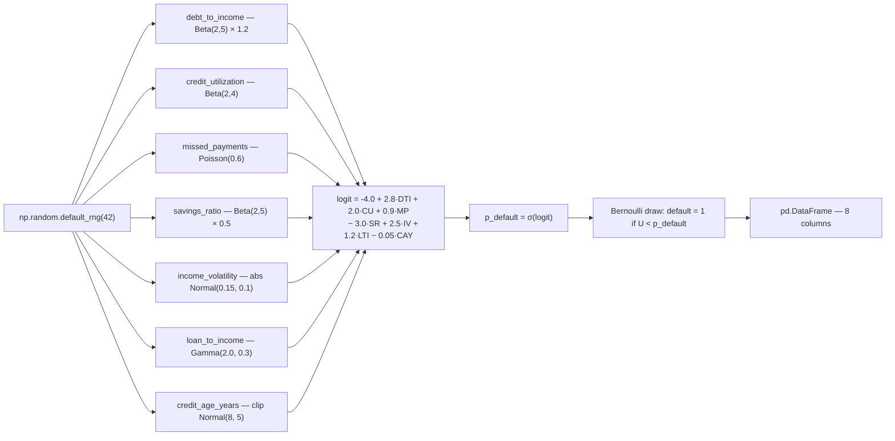
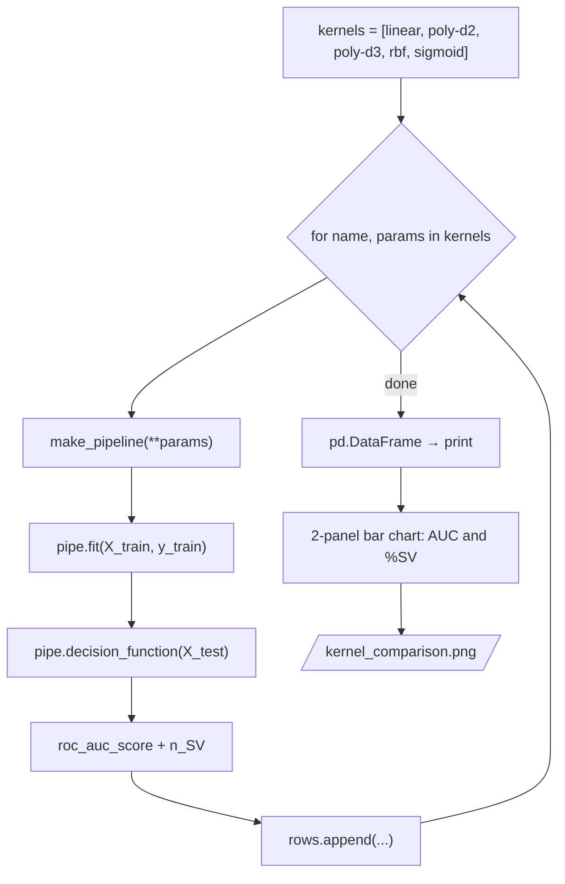
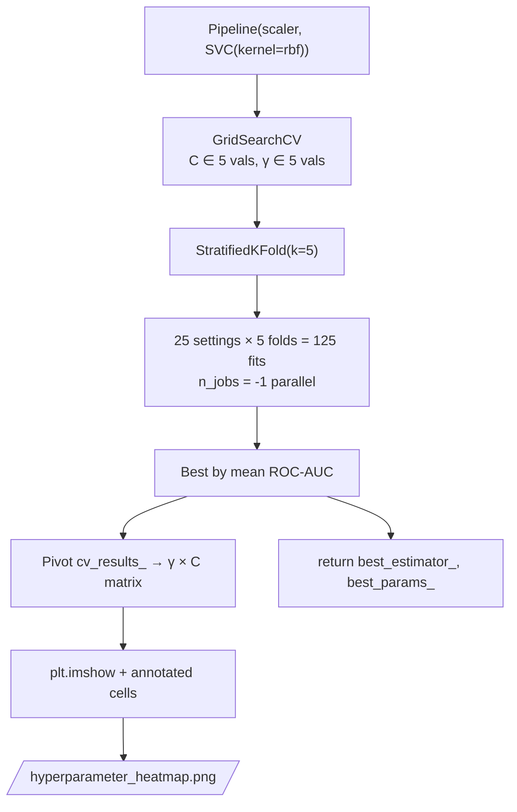
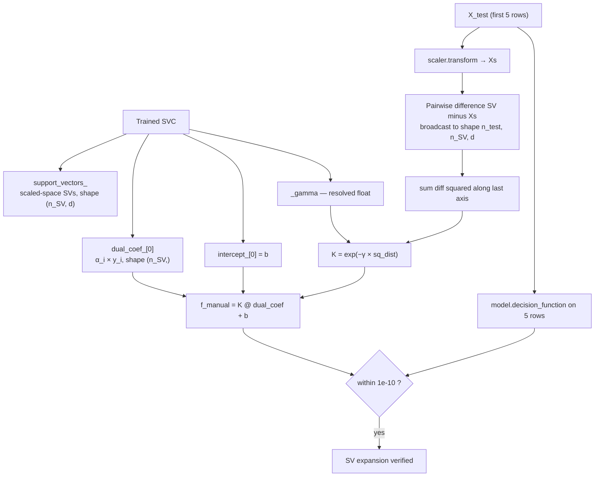
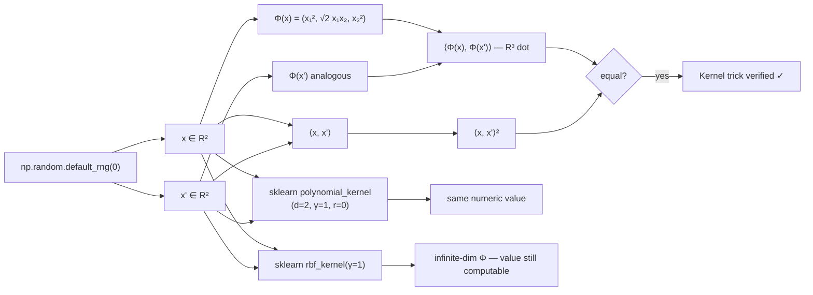
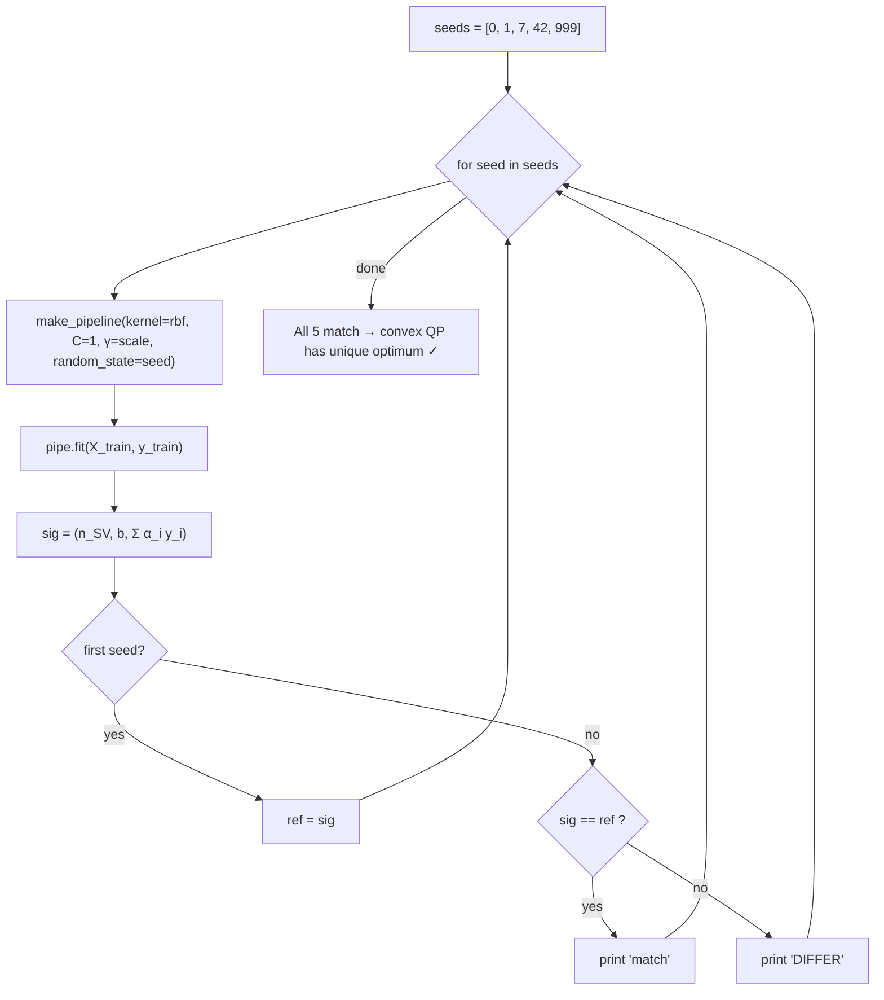
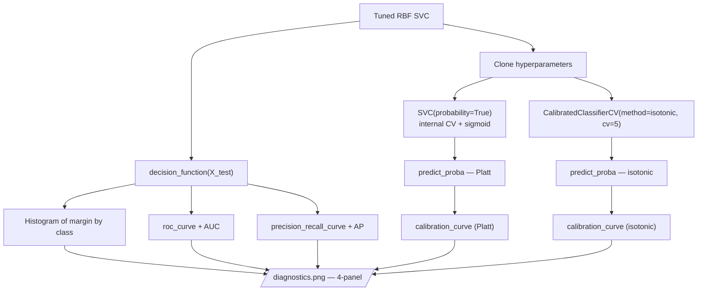
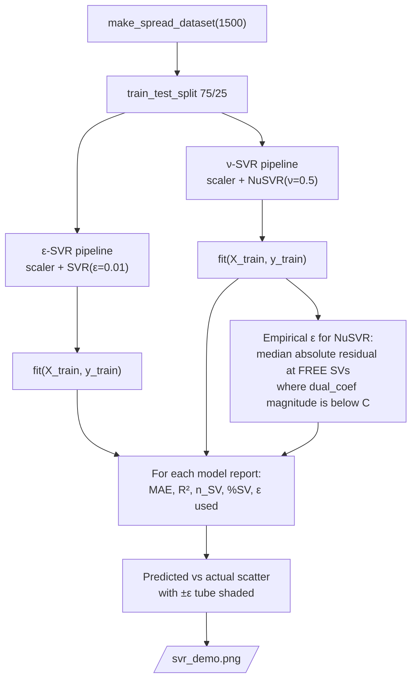

# Lecture 02 — Code Structure

Flow-chart view of [`svm_loan_default.py`](svm_loan_default.py).
Diagrams use [Mermaid](https://mermaid.js.org/) — GitHub renders them inline.

The script is organised in three layers, mirroring Halperin's *SVM in
Finance* slides (NYU Tandon, 2017):

* **Part I** — primal SVR / SVC, ε-insensitive loss, soft-margin `C`, scaling.
* **Part II** — KKT conditions, the dual, the support-vector expansion,
  convex optimisation.
* **Part III** — the kernel trick: features `Φ(x)` replaced by a kernel `k(x, x')`.

---

## 1. Top-level execution flow (`main()`)

The orchestration of every analysis step, in the order `main()` runs them.

```mermaid
flowchart TD
    Start([python svm_loan_default.py]) --> Mkdir[os.makedirs svm_plots/]
    Mkdir --> Data["make_loan_dataset — 3000 borrowers, default ~18%"]
    Data --> Split["train_test_split — stratified 75/25"]

    Split --> Kernels["kernel_comparison — 5 kernels<br/>→ kernel_comparison.png"]
    Kernels --> Grid["cgamma_heatmap — 5×5 grid, 5-fold CV<br/>→ hyperparameter_heatmap.png"]
    Grid --> Eval["Tuned RBF eval — accuracy, AUC, AP, CM, report"]
    Eval --> LR["LogisticRegression baseline — sanity-check vs kernel SVM"]

    LR --> SV["support_vector_analysis — dual_coef_, free vs bounded SVs"]
    SV --> Manual["manual_decision_function — rebuild f(x) by hand"]
    Manual --> Convex["convexity_demo — 5 seeds → identical α, b"]

    Convex --> Trick["kernel_trick_demo — verify ⟨Φ, Φ'⟩ = ⟨x, x'⟩²"]

    Trick --> Diag["diagnostics — margin hist + calibration + ROC + PR<br/>→ diagnostics.png"]
    Diag --> Perm["permutation_importances<br/>→ permutation_importance.png"]
    Perm --> Thr["threshold_tuning — FN cost = 5, FP cost = 1<br/>→ threshold_cost.png"]
    Thr --> LC["learning_curve_plot<br/>→ learning_curve.png"]
    LC --> Bdy["decision_boundary_2d — RBF contour with SVs<br/>→ decision_boundary_2d.png"]

    Bdy --> SVR["svr_demo — ε-SVR + ν-SVR on credit spreads<br/>→ svr_demo.png"]
    SVR --> New["Score a brand-new borrower"]
    New --> End([8 plots written to svm_plots/])
```



---

## 2. Slide concept → function map

Which slide concept is demonstrated in which function.



---

## 3. Dataset generation (`make_loan_dataset`)

Each borrower's default label comes from a *known* logit model so we can
diagnose the SVM against ground truth.



---

## 4. Kernel comparison (`kernel_comparison`)



---

## 5. (C, γ) grid search (`cgamma_heatmap`)



---

## 6. Manual SV expansion (`manual_decision_function`)

Reconstructs the slide formula `f(x) = Σᵢ (αᵢ yᵢ) k(xᵢ, x) + b` from
sklearn's stored primitives and checks it matches `decision_function`.



---

## 7. Kernel-trick demo (`kernel_trick_demo`)

Numerically verifies `⟨Φ(x), Φ(x')⟩ = ⟨x, x'⟩²` for the slide's
quadratic feature map `Φ(x) = (x₁², √2 x₁ x₂, x₂²)`.



---

## 8. Convexity demo (`convexity_demo`)



---

## 9. Diagnostics (`diagnostics`)



---

## 10. SVR demo (`svr_demo`)



---

## 11. Output artifacts

```
lecture_02/svm_plots/
├── kernel_comparison.png       — AUC + %SV bar charts per kernel
├── hyperparameter_heatmap.png  — 5×5 CV-AUC heatmap over (C, γ)
├── diagnostics.png             — 4-panel: margin hist, calibration, ROC, PR
├── permutation_importance.png  — horizontal bars of AUC drop per feature
├── threshold_cost.png          — expected loss vs threshold
├── learning_curve.png          — train/val AUC vs training size
├── decision_boundary_2d.png    — RBF contour on (DTI, credit_util)
└── svr_demo.png                — predicted vs actual + ε-tube (ε-SVR & ν-SVR)
```

---

Function names in the diagrams match exactly the function definitions in
[`svm_loan_default.py`](svm_loan_default.py) — jump to any function to
read its implementation.
